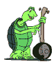
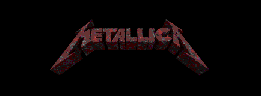
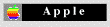
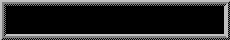

<link rel="stylesheet" href="static/css/README.css" />

<h1 align="center">
  
</h1>

  
    
  

  
  
  
  
  

<!-- Animaciones CSS -->

  <picture>
    <source media="(prefers-color-scheme: dark)" srcset="https://raw.githubusercontent.com/dgmnzrd/dgmnzrd/output/github-contribution-grid-snake-dark.svg">
    <source media="(prefers-color-scheme: light)" srcset="https://raw.githubusercontent.com/dgmnzrd/dgmnzrd/output/github-contribution-grid-snake.svg">
  </picture>

---

## 🌵 About Me

  <ul class="about-list">
    <li class="about-item">
      🎓
      <strong>Computer Systems Engineering</strong> student at <strong>Instituto Tecnológico de La Laguna</strong>
    </li>
    <li class="about-item">
      🎖️
      <strong>Professional Technical Bachelor</strong> in <strong>Electronic Systems Maintenance</strong> - <a href="https://web.seducoahuila.gob.mx/profesiones/tucedula.php?cedula=0521012052">View Credential</a>
    </li>
    <li class="about-item">
      🇲🇽
      From <strong>Torreón, Coahuila, Mexico</strong> — proudly <strong>Lagunero</strong>
    </li>
    <li class="about-item">
      💻
      <strong>FullStack Web Developer</strong> specialized in <strong>PHP</strong> and <strong>Laravel</strong>
    </li>
    <li class="about-item">
      🍎
      <strong>iOS enthusiast</strong> enjoying <strong>SwiftUI</strong> and <strong>Objective-C</strong>
    </li>
    <li class="about-item">
      🖥️
      Exploring the depths of <strong>C/C++</strong> just for the fun of it
    </li>
    <li class="about-item">
      🐢
      My spirit animal is the <strong>turtle</strong> - slow but steady wins the race!
    </li>
  </ul>

## 🛠️ Tech Stack

  

    
  

   
  

    
    
    
    
    
    
  

  

    
    
    
    
    
    
  

## 🎸 Passions

<table align="center">
  <tr>
    <td align="center" width="33%">
       
      <b>Heavy Metal Enthusiast</b> 
      <small>Especially Metallica 🤘</small>
      

        98%
      

    </td>
    <td align="center" width="33%">
       
      <b>Apple Ecosystem</b> 
      <small>iOS Development & More</small>
      

        85%
      

    </td>
    <td align="center" width="33%">
       
      <b>Mexican Culture</b> 
      <small>Proud of my roots</small>
      

        100%
      

    </td>
  </tr>
</table>

  
### 📊 GitHub Stats & Activity

  
  

 

  

 

  

  

 

---

  <h3>📫 Get in Touch</h3>
  
  
  
  
  
Feel free to explore my repositories or reach out — I'm always open to learning and collaborating!

  
  
  
  <!-- Animación de typewriter -->
  

    

      
Thanks for visiting my profile! Keep coding! 💻

    

  

<!-- Fun Easter Egg: The turtle is always slow but never gives up! 🐢 -->
<!-- Last updated: May 2025 by dgmnzrd -->
<!-- Special thanks to everyone who supported me on my coding journey -->
<!-- "My code doesn't work, I have no idea why. My code works, I have no idea why." -->

